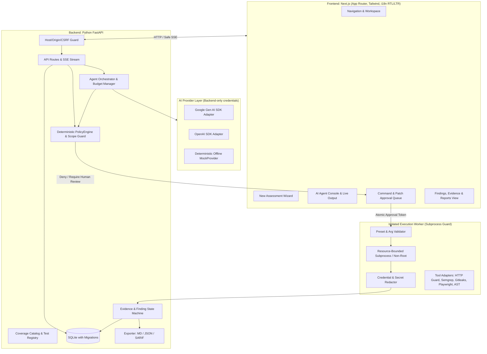

# Tawassl Security Studio (استوديو تواصل للأمن السيبراني)
## Comprehensive Architecture & Implementation Plan

---

### Executive Summary

**Tawassl Security Studio** (`tawassl-security-studio`) is a local-first, privacy-respecting AI security assessment and functional bug exploration workspace. It provides human-in-the-loop oversight, strict deterministic scope enforcement, sandboxed command execution, and AI-driven assessment planning powered by Google Gemini, OpenAI GPT, or an offline `MockProvider`.

This plan details the complete end-to-end architecture, threat model, component breakdown, database schema, and an incremental 10-phase vertical-slice delivery schedule.

---

## 1. System Architecture Overview



---

## 2. Technology Stack & Environment

| Component | Technology | Rationale |
| :--- | :--- | :--- |
| **Frontend** | Next.js 15 (App Router), TypeScript, Tailwind CSS, Lucide-react | Responsive, high-performance local web app with native Arabic RTL / English LTR support |
| **Backend API** | Python 3.12+, FastAPI, Pydantic v2 | High-throughput async API, strict data validation, seamless integration with AI & security tool ecosystems |
| **Storage** | SQLite + `sqlite3`/Alembic migrations | Zero-dependency local persistence, atomic single-user transactions, reproducible state |
| **AI Integration** | `google-genai` (official SDK), `openai` (official SDK) | Independent adapters, typed tool calling, backend-only secret management |
| **Mock Engine** | Custom `MockProvider` | 100% offline development, test automation without API keys, zero external data leakage |
| **Worker Isolation** | Python `asyncio.subprocess` sandbox wrapper | Strict process trees, memory/CPU/time limits, drop root, no environment/secret leaks |
| **Testing** | `pytest`, `pytest-asyncio`, Playwright | Deterministic fixtures, policy bypass tests, race-condition and budget exhaustion tests |

---

## 3. Core Modules & Specifications

### 3.1 PolicyEngine & Scope Enforcement (Section 7)
- **Zero-Trust Scope Policy**: An empty scope denies all actions by default.
- **SSRF & Network Guard**:
  - Validates scheme (`http`/`https`), explicit ports, exact hostnames.
  - Resolves DNS and blocks loopback (`127.0.0.0/8`, `::1`), private ranges (`10.0.0.0/8`, `172.16.0.0/12`, `192.168.0.0/16`), link-local (`169.254.0.0/16`), and AWS/GCP cloud metadata IPs.
  - Re-checks resolved IP on every redirect (prevents DNS rebinding and redirect escapes).
- **Workspace Sandbox Guard**:
  - Resolves canonical paths (`os.path.realpath`).
  - Prohibits path traversal (`..`), symlink escapes outside the target project folder, and access to sensitive directories (`~/.ssh`, `~/.aws`, `/etc`).

### 3.2 Command Proposal & Approval Engine (Section 8)
- **Immutable Proposals**:
  - Contains tool name, validated arguments, target ID, working directory, rationale, estimated resource limits.
  - Generates a canonical SHA-256 hash of `(user_id, assessment_id, tool_name, sorted_args, policy_version)`.
- **Atomic Single-Use Approvals**:
  - Approval tokens are stored in SQLite and can be consumed exactly once.
  - Any argument change or expiration invalidates the proposal.
  - Absolutely **no** `shell=True`, `eval()`, or unescaped `bash -c`. Only registered command presets with array arguments.

### 3.3 Agent Orchestration Loop & Hard Budgets (Section 6)
- **Budget Dimensions**:
  1. Maximum steps (e.g., default 20 steps).
  2. Maximum external requests (e.g., default 50 HTTP calls).
  3. Maximum tool calls (e.g., default 30 calls).
  4. Run duration limit (e.g., timeout after 300 seconds).
  5. Maximum output size (e.g., 2 MB buffer cap).
- **Enforcement**:
  - Retries decrement budgets.
  - Hard stop triggers immediately upon reaching any limit.
  - Untrusted inputs (webpages, scanner outputs) are wrapped in clear data delimiters to mitigate prompt injection.

### 3.4 Findings & Evidence State Machine (Section 12)
- **Status Lifecycle**:
  `Observation` ➔ `Suspected` ➔ `Confirmed` ➔ `Fixed` (or `False Positive` / `Inconclusive` / `Retest Failed`).
- **Strict Verification Rules**:
  - XSS cannot be marked `Confirmed` on reflection alone; requires executed context proof.
  - CSRF requires state change verification, not missing header hints.
  - IDOR requires differential authorization response verification across 2 accounts.
- **Redaction Engine**:
  - Redacts Bearer tokens, API keys, passwords, and sensitive cookies before recording evidence.

### 3.5 Bilingual User Interface (Arabic RTL / English LTR) (Section 11)
- Seamless toggle between Arabic (`dir="rtl"`, font: Cairo / IBM Plex Sans Arabic) and English (`dir="ltr"`, font: Inter).
- Dark and Light themes with high-contrast accessibility.
- Views:
  1. **Dashboard**: Assessment health, active tests, live stats, risk overview.
  2. **New Assessment Wizard**: 8-step wizard (Target, Scope, Auth, Profile, Limits, Review).
  3. **Targets & Scope**: Visual scope editor, exclusion lists, validation status.
  4. **Assessment Plans**: Test coverage matrix (Implemented vs Pending).
  5. **AI Agent Console**: Streaming agent thoughts, tool proposals, step timeline.
  6. **Command Queue**: Pending proposals with interactive "Approve Once", "Reject", "Stop".
  7. **Live Output**: Sanitized streaming terminal viewer with pause/scroll-lock.
  8. **Findings & Evidence**: Severity badges, reproduction steps, raw HTTP/code evidence.
  9. **Reports**: Instant preview & download (Markdown, JSON, SARIF 2.1.0).
  10. **Settings**: Model IDs, API keys, budget presets, local server security tokens.

---

## 4. Delivery Roadmap: 10 Vertical Slices

```mermaid
gantt
    title Tawassl Security Studio Implementation Slices
    dateFormat  X
    axisFormat  Slice %d

    section Phase 1: Core Foundation
    Slice 1: Scaffold, DB & Health Endpoint       :active, s1, 0, 1
    Slice 2: Complete UI Flow with Mock Data      :s2, 1, 2
    Slice 3: PolicyEngine & Approval Subsystem    :s3, 2, 3

    section Phase 2: Execution & AI
    Slice 4: Isolated Worker & Offline Tools      :s4, 3, 4
    Slice 5: AI Provider Adapters (Gemini/GPT/Mock):s5, 4, 5
    Slice 6: Agent Loop & Budget Enforcement      :s6, 5, 6

    section Phase 3: Verification & Integration
    Slice 7: Controlled Network Testing           :s7, 6, 7
    Slice 8: Findings, Evidence & Exporters       :s8, 7, 8
    Slice 9: Scanner & Browser Integrations       :s9, 8, 9
    Slice 10: Fix-and-Retest Workflow & CI Suite  :s10, 9, 10
```

### Detailed Slices Breakdown:

1. **Slice 1: Scaffold, Database, and Health Endpoint**
   - Initialize monorepo structure with Next.js frontend and Python FastAPI backend.
   - Setup SQLite database with schema for Projects, Targets, Assessments, Plans, Approvals, Findings, and Audit Logs.
   - Setup health check endpoint (`/api/health`) and security headers middleware.

2. **Slice 2: Complete UI Flow Using Clearly Labeled Mock Data**
   - Implement Next.js App Router layout with bilingual (Arabic/English) support and theme switching.
   - Build all 10 core navigation views with mock state.
   - Implement the 8-step Assessment Wizard.

3. **Slice 3: Scope and Approval Engine**
   - Implement `PolicyEngine` (CIDR checks, DNS resolution guard, canonical path resolution, scope boundaries).
   - Implement Proposal & Approval state machine with atomic SHA-256 tokens and CSRF protection.
   - Unit tests for scope bypass attempts, traversal, and approval tampering.

4. **Slice 4: Isolated Worker with Offline Tools**
   - Implement safe subprocess execution runner with resource constraints (timeout, memory, output buffer).
   - Implement file reader and AST Python syntax inspector tool adapters.
   - Process tree cancellation and output streaming.

5. **Slice 5: Gemini, GPT, and Mock Adapters**
   - Implement unified `BaseAIProvider` interface with typed tool-call parsing.
   - Implement `GeminiProvider` using the official `google-genai` SDK.
   - Implement `OpenAIProvider` using the official `openai` SDK.
   - Implement `MockProvider` providing deterministic, recorded scenario outputs for key test cases.

6. **Slice 6: Agent Orchestration with Hard Limits**
   - Build the step-by-step agent loop: Plan ➔ Propose ➔ Policy Validate ➔ Request Approval ➔ Execute ➔ Observe.
   - Hard budget manager enforcing step limits, request limits, time limits, and budget exhaustion stops.

7. **Slice 7: Controlled Network Testing**
   - Safe HTTP client adapter with custom transport enforcing SSRF blocklists on initial connect and every redirect.
   - Implement Observe profile checks (TLS verification, security headers, cookie flags).

8. **Slice 8: Findings, Evidence, and Reports**
   - Finding lifecycle state machine with evidence attachments.
   - Exporters for Markdown, structured JSON, and OASIS SARIF v2.1.0.

9. **Slice 9: Scanner and Browser Integrations**
   - Adapters for Semgrep (source SAST) and Gitleaks (secret detection) running within the worker sandbox.
   - Playwright adapter for headless browser DOM inspection and navigation checks.

10. **Slice 10: Fix-and-Retest Workflow, Documentation & CI**
    - Diff generator for source code fixes with patch validation and revert support.
    - Comprehensive test suite (unit, integration, security fixtures).
    - Bilingual English & Arabic `README.md`, `ARCHITECTURE.md`, `THREAT_MODEL.md`.

---

## 5. Verification & Test Plan

| Test Category | Target Scenarios | Success Criteria |
| :--- | :--- | :--- |
| **Scope & SSRF** | `127.0.0.1`, `http://169.254.169.254`, DNS rebinding mock, redirect to private IP | Immediate policy denial; zero socket creation |
| **Path Traversal** | `../../etc/passwd`, symlinks outside target directory | Rejected with `PathEscapedScopeError` |
| **Approval Integrity**| Modifying proposal args after approval, concurrent consumption | Execution rejected; approval invalidated |
| **Hard Budgets** | Loop exceeding 10 steps or 25 requests | Agent loop terminates with `BudgetExhausted` state |
| **Worker Isolation** | Untrusted command injection, subshell escape, environment inspection | No shell executed; provider keys not exposed |
| **Offline Mode** | Complete wizard to scan to report execution with `MockProvider` | Full workflow succeeds with 0 external API calls |

---

## 6. Next Steps

Upon your approval, we will proceed immediately with **Slice 1**:
1. Scaffold the monorepo directory layout (`apps/web`, `apps/backend`).
2. Setup the Python environment, dependencies, FastAPI server, and SQLite migrations.
3. Build the core SQLite schema and the health verification endpoints.
